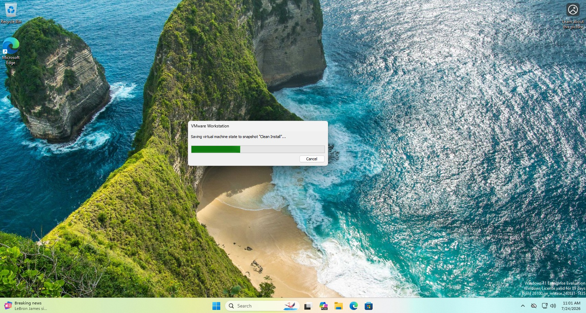
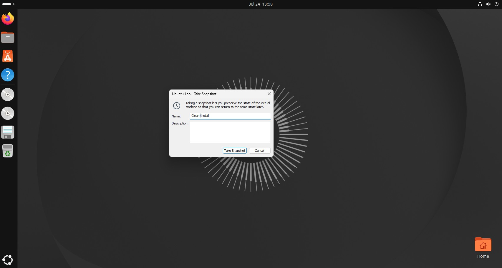
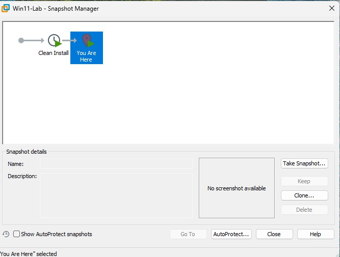

# Lab 1b — Master Snapshots (Your Undo Button)

**Exam:** CompTIA A+ Core 1 · Virtualisation · Beginner · ~10 min
**Date completed:** 2026-07-23
**Environment:** VMware Workstation Pro · `Win11-Lab` VM (from Lab 1)

---

## Objective

Learn to take, restore, and manage VMware snapshots so any lab that changes a VM can be rolled back in seconds. Snapshots are the safety net that makes "break things on purpose" possible for every lab that follows.

## What I need

- The `Win11-Lab` VM built in Lab 1
- The 'Ubuntu-Lab' VM built in Lab 1

## What I did

1. Selected the `Win11-Lab` VM and went to **VM → Snapshot → Take Snapshot** (also reachable from the Snapshot Manager on the toolbar).
2. Named the snapshot `Clean install` and saved it — this freezes the current disk + memory state as a restore point.
3. Booted the VM and made an obvious change: Created a Test Folder on the desktop.
4. Opened **VM → Snapshot → Snapshot Manager**, selected the `Clean install` snapshot, and clicked **Go To** to restore it.
5. Booted again and confirmed the change was gone — the shortcut and original wallpaper were back.
6. Repeated it on the Ubuntu-Lab VM

## Screenshots

> Snapshot dialog named Clean install in Windows

> Snapshot dialog named Clean install in Ubuntu

Snapshot Manager example for Windows VM

## What broke / how I fixed it

- **Restoring reverted more than expected.**
  *Cause:* a snapshot captures the *entire* VM state, so restoring `Clean install` rolled back every change since that point — not just the wallpaper. Expected behavior, but a good reminder.
  *Resolution:* take a fresh snapshot **before** each lab (not one big baseline), so I only roll back the work of that single lab.

- **Snapshot files grew disk usage fast.**
  *Cause:* each snapshot keeps a delta of changes, so keeping many snapshots inflates the VM's footprint on the host.
  *Resolution:* delete stale snapshots in Snapshot Manager once a lab is verified. Learned that **deleting/consolidating** a snapshot merges its changes forward — it does *not* discard my work (that's what **Go To** does).

## Verification (how I confirmed it worked)

- After **Go To**, the created shortcut appeared — proof the restore worked.
- Snapshot Manager shows the `Clean install` node with the "You Are Here" marker on the current state.

## Exam relevance (how this shows up on the A+)

- **Snapshots vs. backups:** a snapshot is a point-in-time state *within* the hypervisor, not a true backup — it lives on the same host/disk, so it won't survive drive failure. Backups (Lab 23, 3-2-1 rule) are separate.
- **Purpose of virtualisation:** fast rollback for testing, sandboxing, and safe experimentation is a core reason VMs are used — likely PBQ/scenario material. Also, one host can support many VMS to take full advantage of resources.
- **Restore points parallel:** conceptually similar to Windows System Restore points and to reverting a config change during the 7-step troubleshooting method (Lab 13).

---

*Companion to my CompTIA A+ Hands-On Lab Manual · Section A — Build Your Lab Environment*
